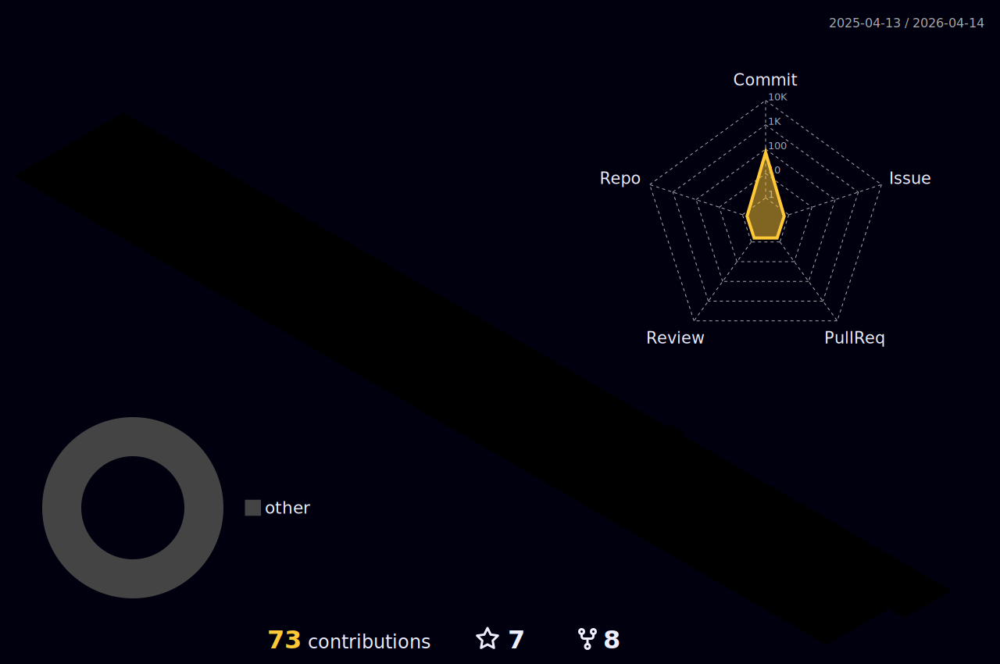

### Hi there 👋

<!--
**iVuDang/iVuDang** is a ✨ _special_ ✨ repository because its `README.md` (this file) appears on your GitHub profile.

Here are some ideas to get you started:

- 🔭 I’m currently working on ...
- 🌱 I’m currently learning ...
- 👯 I’m looking to collaborate on ...
- 🤔 I’m looking for help with ...
- 💬 Ask me about ...
- 📫 How to reach me: ...
- 😄 
- ⚡ Fun fact: ...
- Travel... exploring, adventures, 
Media production, art of visual storytelling through film and sound

react
github_dark
algolia

:airplane:
:world_map:
:earth_asia:
-->

# 🔧 Technologies & Tools

<table>
  <tr> <!-- Start - Table Row 1 --> 
    <td align="center" height="108" width="108">
      
        <strong>HTML5</strong>
    </td>
    <td align="center" height="108" width="108">
      
        <strong>CSS3</strong>
    </td>
    <td align="center" height="108" width="108">
      
        <strong>JavaScript</strong>
    </td>
    <td align="center" height="108" width="108">
      
        <strong>TypeScript </strong>
    </td>
  </tr><!-- End - Table Row 1 -->        
  <tr> <!-- Start Table Row 2 --> 
    <td align="center" height="108" width="108">
      
       <strong>Node.js</strong>
    </td>
    <td align="center" height="108" width="108">
      
       <strong>Express</strong>
    </td>
    <td align="center" height="108" width="108">
      
       <strong>MongoDB</strong>
    </td>
  </tr>  <!-- Start Table Row 2 --> 
  <tr>  <!-- Start Table Row 3 -->  
    <td align="center" height="108" width="108">
      
        <strong> Visual Studio Code </strong>
    </td>
   </tr>  <!-- Start Table Row 3 --> 
</table>  
          
          
<!-- TOP LANGUAGES BAR --> 

<!-- 3D ANIMATED GIT CONTRIBUTION DATA BARS  -->

<!--

https://shields.io/
https://github.com/anuraghazra/github-readme-stats

https://github.com/marketplace/actions/github-profile-3d-contrib
https://github.com/yoshi389111/github-profile-3d-contrib

https://dev.to/envoy_/150-badges-for-github-pnk

-->
