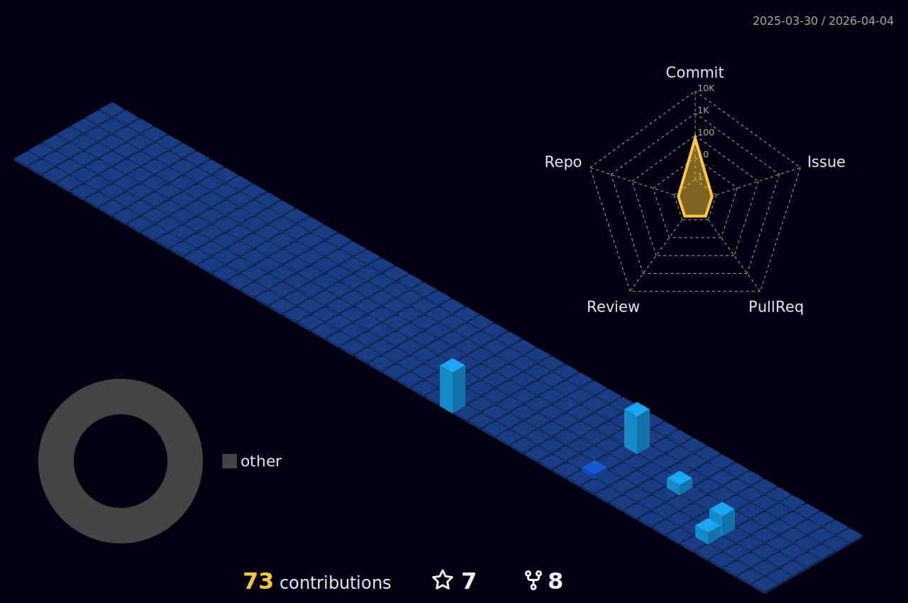

### Hi there 👋

<!--
**iVuDang/iVuDang** is a ✨ _special_ ✨ repository because its `README.md` (this file) appears on your GitHub profile.

Here are some ideas to get you started:

- 🔭 I’m currently working on ...
- 🌱 I’m currently learning ...
- 👯 I’m looking to collaborate on ...
- 🤔 I’m looking for help with ...
- 💬 Ask me about ...
- 📫 How to reach me: ...
- 😄 
- ⚡ Fun fact: ...
- Travel... exploring, adventures, 
Media production, art of visual storytelling through film and sound

react
github_dark
algolia
-->

<!--

https://shields.io/
https://github.com/anuraghazra/github-readme-stats

https://github.com/marketplace/actions/github-profile-3d-contrib
https://github.com/yoshi389111/github-profile-3d-contrib

https://dev.to/envoy_/150-badges-for-github-pnk

-->
