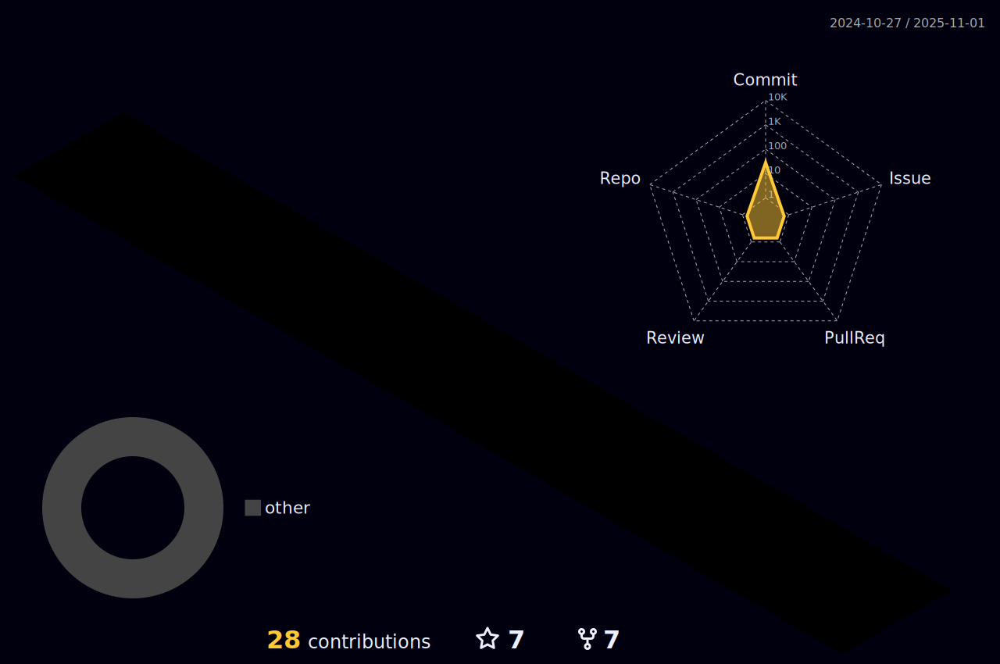

### Hi there 👋

- 🔭 I’m currently working on ...
- 🌱 I’m currently learning C++
- 🤔 I’m looking for help with ...
- 💬 Ask me about ...
- 📫 How to reach me: ...
- :airplane:
- :world_map: Media production, art of visual storytelling through film and sound
- :earth_asia: Travel... exploring, adventures, 

- - - -

<!-- SKILLS TABLE AND ICONS --> 

## :computer: Technologies & Tools

<table>
  <tr> <!-- Start - Table Row 1 --> 
    <td align="center" height="108" width="108">
      
        <strong> HTML </strong>
    </td>
    <td align="center" height="108" width="108">
      
        <strong> CSS </strong>
    </td>
    <td align="center" height="108" width="108">
      
        <strong> JavaScript </strong>
    </td>
    <td align="center" height="108" width="108">
      
        <strong> Python </strong>
    </td>
    <td align="center" height="108" width="108">
      
        <strong> SQL </strong>
    </td>
    <td align="center" height="108" width="108">
      
        <strong> C++ </strong>
    </td>
    <td align="center" height="108" width="108">
      
       <strong> Git </strong>
    </td>
    <td align="center" height="108" width="108">
          
       <strong> GitHub </strong>
    </td>
  </tr> <!-- End - Table Row 1 -->        
  <tr> <!-- Start Table Row 2 --> 
    <td align="center" height="108" width="108">
      
        <strong> Visual Studio Code </strong>
    </td>
    <td align="center" height="108" width="108">
      
        <strong> Excel </strong>
    </td>   
    <td align="center" height="108" width="108">
      
        <strong> Power BI </strong>
    </td>   
    <td align="center" height="108" width="108">
      
        <strong> Canva </strong>
    </td>              
    <td align="center" height="108" width="108">
      
        <strong> Premiere Pro </strong>
    </td>          
    <td align="center" height="108" width="108">
      
        <strong> Illustrator </strong>
    </td>  
  </tr>  <!-- End - Table Row 2 -->              
</table>  
        
                                
<!-- TOP LANGUAGES BAR --> 

                 

- - - -

<!-- 3D ANIMATED GIT CONTRIBUTION DATA BARS  -->
## :chart_with_upwards_trend: My Stats

                         
                         
<!-- PROJECTS TIMELINE  -->
### :card_index_dividers: Projects Listing Timeline 

**freeCodeCamp - Computing with Python** 
                         
* [Design effective reports in Power BI] (https://github.com/iVuDang/freeCodeCamp-Probability-Calculator)
* [Design effective reports in Power BI] (https://github.com/iVuDang/freeCodeCamp-Probability-Calculator)     
                         

[The Odin Project - SQL Zoo](https://github.com/iVuDang/The-Odin-Project-SQL-Zoo-SELECT-FROM-WHERE)
                         
                         
                         
                         
                        
<!--
**iVuDang/iVuDang** is a ✨ _special_ ✨ repository because its `README.md` (this file) appears on your GitHub profile.

- 🔭 I’m currently working on ...
- 🌱 I’m currently learning C++
- 👯 I’m looking to collaborate on ...
- 🤔 I’m looking for help with ...
- 💬 Ask me about ...
- 📫 How to reach me: ...
- 😄 
- ⚡ Fun fact: ...

Themes:
react
github_dark
algolia

:airplane:
:world_map:
:earth_asia:
-->

                         
<!--
RESOURCES
https://devicon.dev/

https://github.com/anuraghazra/github-readme-stats

https://github.com/marketplace/actions/github-profile-3d-contrib
https://github.com/yoshi389111/github-profile-3d-contrib

https://shields.io/

https://dev.to/envoy_/150-badges-for-github-pnk
                         
https://github.com/vn7n24fzkq/github-profile-summary-cards

                         

SVG SKILL ICONS ADD LATER:
SOFTWARE
https://cdn.jsdelivr.net/gh/devicons/devicon/icons/react/react-original.svg
https://cdn.jsdelivr.net/gh/devicons/devicon/icons/pandas/pandas-original.svg
https://cdn.jsdelivr.net/gh/devicons/devicon/icons/numpy/numpy-original.svg
https://cdn.jsdelivr.net/gh/devicons/devicon/icons/nodejs/nodejs-original.svg
https://cdn.jsdelivr.net/gh/devicons/devicon/icons/mongodb/mongodb-original.svg     
https://cdn.jsdelivr.net/gh/devicons/devicon/icons/django/django-plain.svg
https://cdn.jsdelivr.net/gh/devicons/devicon/icons/mysql/mysql-original.svg
https://cdn.jsdelivr.net/gh/devicons/devicon/icons/tensorflow/tensorflow-original.svg
https://cdn.jsdelivr.net/gh/devicons/devicon/icons/postgresql/postgresql-original.svg
https://cdn.jsdelivr.net/gh/devicons/devicon/icons/matlab/matlab-original.svg
                                                                  
                                
MEDIA
https://cdn.jsdelivr.net/gh/devicons/devicon/icons/photoshop/photoshop-plain.svg
https://cdn.jsdelivr.net/gh/devicons/devicon/icons/xd/xd-plain.svg
                                
                                        
SVG SOCIAL MEDIA 
https://cdn.jsdelivr.net/gh/devicons/devicon/icons/linkedin/linkedin-original.svg
https://cdn.jsdelivr.net/gh/devicons/devicon/icons/java/java-original.svg
https://cdn.jsdelivr.net/gh/devicons/devicon/icons/codepen/codepen-plain.svg
                
-->
                         
                         
